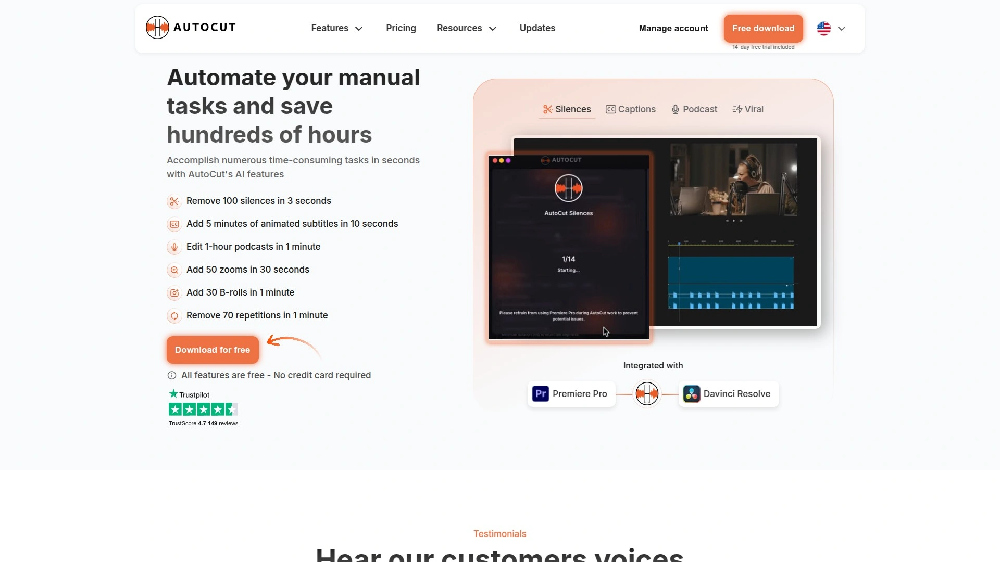

# 再也不用手动给视频加字幕了!推荐14款AI自动生成的神器!

80%的社交媒体视频是静音播放的,没有字幕意味着你的内容直接被滑过。手动给每条视频打字幕?一个5分钟的视频要花1小时对时间轴,还得逐字检查拼写错误。外包给字幕师?成本高不说,来回修改的沟通成本更让人头疼。AI字幕生成工具正在解决这个痛点——上传视频,几分钟内自动识别语音并生成准确字幕,支持70多种语言,准确率达到95%以上,直接导出SRT文件或嵌入视频。这份榜单按自动化程度、准确度、编辑便捷性综合排序,涵盖从免费到专业级的14个平台,帮你用最短时间让视频字幕完美上线。

## **[Zubtitle](https://zubtitle.com)**

专为社交媒体设计的在线视频编辑器,自动字幕+标题+裁剪一站式搞定,几分钟优化短视频。

Zubtitle的定位非常清晰——帮创作者快速创建适合社交媒体的视频内容。当你的目标是在Instagram、TikTok、Facebook上发布视频时,Zubtitle能让整个流程变得超级简单。自动转录功能会把视频里的语音转换成字幕,不需要你手动打字。

但它不只是加字幕——还能添加吸引眼球的标题栏,用内置文本编辑器预告视频内容,引导观众继续看下去。快速裁剪和画面比例调整工具能让你一键适配不同平台要求,从方形到竖屏到宽屏都能搞定。拖拽式编辑器让你只需几次点击就能上传自定义logo或水印。

可以使用品牌字体和颜色,添加进度条,保存自己的模板以加快后续编辑速度。生成的字幕可以导出为TXT或SRT文件。免费试用计划让你上传1个视频并访问所有编辑功能(包括字幕),完全免费。支持移动设备,iOS和Android都能用。

接受MP4、MOV、M4V格式的视频,大小不超过1GB,分辨率最高4096x2160,时长20分钟以内。对于想快速制作社交媒体短视频、不需要复杂剪辑功能的创作者,Zubtitle的简洁性和针对性是最大优势。

## **[VEED.io](https://veed.io)**

功能最全面的在线视频编辑平台,99.9%字幕准确率,一键翻译成100多种语言。

VEED不只是字幕生成器,而是完整的视频编辑套件。自动字幕功能准确率高达99.9%,支持超过100种语言的实时转录。时间轴编辑界面跟传统剪辑软件类似,但完全基于浏览器,不需要下载安装。

AI翻译功能能把字幕一键转换成其他语言,扩大内容覆盖范围。眼神接触修正功能用AI调整演讲者的眼神方向,让视频看起来更专业。语音和音频清理工具能移除背景噪音,提升音质。

屏幕录制、品牌工具包、社交媒体格式预设都内置。与OpusClip这种专注裁剪短片的工具相比,VEED提供从创建到编辑到发布的全流程支持。适合需要一个工具完成所有视频工作的团队,而不是在多个应用之间切换。

76%的财富500强企业信任VEED。定价比专注单一功能的工具略高,但考虑到功能全面性,对于高频产出视频的团队性价比很高。

## **[Kapwing](https://kapwing.com)**

专为团队协作设计的视频编辑工具,字幕准确率99%,支持70多种语言。

Kapwing是Descript的顶级在线替代方案,专为需要转录和字幕的视频和播客量身定制。支持70多种语言的字幕生成,准确率达到99%。基于文本的视频编辑器易于使用且用户友好,AI工具帮助创意团队跨所有渠道编辑、协作和再利用内容。

自动字幕生成器能在几秒钟内为视频添加准确同步的字幕。与纯字幕工具相比,Kapwing提供大量视频编辑功能——剪切、合并、添加音乐、转场、特效。团队协作功能让多个成员可以同时在项目上工作,评论和修改实时同步。

可视化编辑器让非技术人员也能快速上手。导出格式灵活,支持SRT、VTT等标准字幕文件。适合营销团队、内容团队、教育机构等需要批量产出视频内容的组织。

提供免费计划,付费计划按月订阅,根据存储空间和功能层级定价。对于需要快速准确字幕且重视团队协作的用户,Kapwing是理想选择。

## **[Descript](https://descript.com)**

文本式视频编辑的先驱,22种语言95%以上准确率,编辑字幕就像编辑文档。

Descript彻底改变了字幕工作流程——大多数字幕工具强迫你先完成视频,然后从头开始字幕流程,Descript让你像编辑文档一样编辑文本,视频及其所有字幕会即时更新。不需要在多个程序之间跳转,或在每次编辑后重做字幕。

跨22种以上语言转录音频和视频,准确率95%以上,字幕与内容完美同步。直接在转录文本中编辑字幕,更改会立即反映在视频时间轴上。导出灵活的字幕格式,包括SRT/VTT文件,或用可定制样式将字幕直接烧录到视频中。

通过简单文本界面编辑视频,使字幕创建和修正像写邮件一样自然。一键移除填充词如"嗯"和"啊",同时清理音频和字幕。支持团队协作的共享项目,非常适合需要多个审阅者的教育内容创作者。

免费计划提供每月1小时转录、自动字幕生成、720p带水印导出。Hobbyist计划每月16美元(年付),Creator计划24美元,Business计划50美元。对于播客主、YouTube创作者、在线教育者,Descript的文本式编辑能显著提升效率。

## **[OpusClip](https://opus.pro)**

AI驱动的短视频裁剪专家,自动识别高光时刻并生成社交媒体爆款片段。

OpusClip专注于把长视频转换成适合TikTok、YouTube Shorts、Instagram Reels的短片段。AI算法会分析视频内容,识别最能引起观众共鸣的关键时刻,并无缝转换成吸引眼球的片段。

动态字幕功能让文字随着语音节奏跳动高亮,视觉效果比静态字幕更吸引人。自动优化画面比例,确保短片段能在各个社交媒体平台上获得最佳展示效果。一键发布功能能同时把视频上传到多个平台。

支持多种语言,与各种视频源无缝集成,简化内容再利用流程。对于创作者、营销人员和企业,OpusClip能扩大触达范围、提升在线存在感、以更有影响力的方式与观众连接。

已帮助超过1000万创作者制作和增长内容。与VEED相比,OpusClip更专注于从长视频提取短片段这个单一场景,自动化程度更高但全面编辑功能较少。适合定期发布长视频(播客、网络研讨会、YouTube视频)并需要快速生成大量社交媒体片段的创作者。

## **[Submagic](https://submagic.co)**

AI字幕神器,自动添加表情符号和关键词强调,48种语言支持。

Submagic用AI驱动的字幕功能变革视频内容——无缝字幕包含完美放置的表情符号和由人工智能精心强调的关键词。这不只是简单的文字转换,而是通过视觉元素增强观众参与度。

先进的自然语言处理技术能准确将口语转换为48种不同语言的文本。自动表情符号功能快速为视频注入情感,突出关键词让重要信息脱颖而出。前沿模板让内容保持时尚并吸引观众注意力。

自动生成引人注目的描述和相关话题标签,通过AI能力最大化可见度和互动。这种创新方法确保内容不仅触达更广泛的受众,还能与他们产生共鸣。

节省宝贵时间、提高可访问性、显著提升观众互动,以前所未有的方式提升内容质量。与Kapwing、VEED、Descript等通用编辑器相比,Submagic更专注于让字幕本身成为内容的吸引点。适合追求高参与度的社交媒体创作者。

## **[Typito](https://typito.com)**

团队最佳字幕编辑器,动态编辑字幕并选择品牌颜色字体风格。

Typito的语音转文本引擎为YouTube、Facebook、LinkedIn、Instagram等社交媒体平台的视频自动生成字幕。生成的字幕与视频中的语音完美同步。可以上传任何语言的字幕文件,Typito会自动将其与视频同步。

字幕不必是无聊的纯文本——可以给它们品牌身份。使用自己的字体和颜色,从精美主题集合中选择字幕样式,以自己的方式设计。一键调整视频格式以适配Facebook、Instagram、Twitter、YouTube和LinkedIn等顶级社交媒体平台。

从20多种格式和画面比例中选择,如1:1方形信箱、9:16竖屏、16:9宽屏。一键调整大小让你以极快速度创建视频。可以将字幕永久添加到MP4(硬编码字幕),这样无论上传到哪个在线社交媒体平台,视频都能让任何无声观看的人访问。

特别适合需要统一品牌视觉的团队和企业。目前自动语音转文本支持英语,准确率85-90%。即使视频被自动转录后,也可以自定义字幕或对文本进行任何更改。

## **[Riverside](https://riverside.fm)**

远程录制+AI字幕一体化平台,快速准确的字幕生成,适合播客和采访。

Riverside不只是字幕工具,而是从录制到编辑的完整解决方案。可以快速准确地为视频添加字幕和副标题。对于远程录制的播客、采访、网络研讨会,Riverside能在同一平台内完成录制和字幕添加,不需要导出到其他工具。

字幕生成速度快且准确,支持多种语言。某些平台如YouTube可以提供自动字幕视频功能。Riverside的优势在于高质量音视频录制与后期处理的无缝整合。

适合定期制作播客、远程采访、在线课程的创作者和教育者。如果你的内容主要是对话类视频,Riverside的录制质量和字幕功能能显著简化工作流程。

## **[SubtitleBee](https://subtitlebee.com)**

自动字幕和翻译工具,120多种语言支持,适合国际化内容。

SubtitleBee专注于自动字幕生成和翻译,支持超过120种语言。对于需要把内容本地化到多个市场的创作者和企业,SubtitleBee的多语言能力是核心优势。

不只是转录原始语音,还能把字幕翻译成目标语言,让全球观众都能理解你的内容。字幕样式可自定义,确保符合品牌视觉。操作流程简单直观,上传视频后选择语言,系统会自动生成并翻译字幕。

导出格式支持SRT、VTT等标准文件,也可以直接将字幕嵌入视频。适合跨国企业、教育机构、希望扩大国际观众的YouTube频道。

## **[AutoCut](https://autocut.com)**

2025年顶级AI字幕工具,自动字幕、动画字幕、多语言支持。

AutoCut提供自动视频字幕、动画字幕和多语言支持等功能,专为提升内容质量而设计。动画字幕功能让文字不只是静态显示,而是通过动画效果吸引观众注意力。

AI技术确保字幕生成快速且准确。对于需要让视频在拥挤的社交媒体信息流中脱颖而出的创作者,AutoCut的视觉增强功能是关键差异点。

多语言支持让你能为不同地区的观众定制字幕。适合营销人员、品牌和内容创作者,他们需要专业视觉效果但不想花时间学习复杂的动画软件。

## **[Happy Scribe](https://happyscribe.com)**

快速准确的字幕生成器,内置翻译功能支持多种语言。

Happy Scribe以速度和准确性著称,转录引擎能快速处理大量视频内容。内置翻译功能让你能把字幕转换成多种语言,无需使用第三方翻译工具。

提供人工审核服务,如果你需要100%准确的字幕(如法律文件、医疗内容),可以选择人工校对。自动生成的字幕通常准确率已经很高,但某些专业领域术语可能需要人工干预。

协作功能让团队成员可以共同审阅和编辑字幕。导出格式全面,支持所有主流视频平台。适合新闻机构、教育机构、企业培训部门等需要大量字幕制作的组织。

## **[Rev](https://rev.com)**

结合AI和人工的字幕服务,99%准确率,24小时内交付。

Rev提供两种字幕服务:AI自动生成(快速便宜)和人工转录(高准确率)。人工转录服务准确率高达99%,非常适合需要绝对精准的场景。24小时内交付承诺让你能按时完成紧急项目。

AI自动字幕服务价格实惠,适合预算有限但仍需要高质量字幕的用户。字幕员都经过培训,熟悉各种行业术语和方言。

支持多种语言,不只是常见的英语、西班牙语,还包括小众语言。提供API接口,可以集成到你的视频制作工作流中。适合需要专业级字幕质量的企业、纪录片制作人、在线课程平台。

## **[Otter.ai](https://otter.ai)**

实时转录和字幕工具,特别适合会议和采访,AI摘要功能强大。

Otter.ai最初为会议转录设计,现在也支持视频字幕生成。实时转录功能让你在录制的同时就能看到文字,非常适合直播和实时字幕需求。

AI摘要功能会自动生成会议或视频的关键要点,节省你回顾内容的时间。说话人识别能区分不同的发言者,并在转录文本中标注。

与Zoom、Google Meet等视频会议平台深度集成,会议结束后自动生成转录和字幕。免费计划每月提供600分钟转录,适合个人用户和小团队。特别适合远程团队、播客主、需要记录大量采访的记者。

## **[Maestra](https://maestra.ai)**

企业级字幕和配音平台,80多种语言,AI声音克隆技术。

Maestra不只提供字幕,还能生成多语言配音。AI声音克隆技术能保留原始演讲者的声音特征,翻译后的配音听起来像同一个人在说不同语言。

支持超过80种语言的字幕和翻译,覆盖全球主要市场。多说话人识别能在视频中区分不同演讲者,并为每个人分配独特声音。

AI重写功能会调整语速,重写过长的片段以更好地同步。唇形同步(测试版)能让口型与翻译后的音频匹配,提供更好的观看体验。

定价从每月60美元到3000美元不等,根据翻译分钟数选择。适合需要将内容本地化到多个国家的跨国企业、在线教育平台、流媒体服务。

## **[Checksub](https://checksub.com)**

AI字幕生成器,视频编辑一体化平台,自动添加字幕并翻译。

Checksub结合了字幕生成和视频编辑功能,让你在一个平台内完成从字幕到发布的全流程。自动字幕引擎准确率高,生成速度快。

翻译功能支持多种语言,可以一键生成多个语言版本的字幕视频。视频编辑工具包括裁剪、合并、添加音乐等基础功能,虽然不如专业剪辑软件那么强大,但对于快速产出社交媒体内容已经足够。

特别适合需要同时制作多语言版本内容的创作者和营销团队。界面简洁,学习曲线平缓,非技术人员也能快速上手。

***

## 常见问题

**AI字幕生成的准确率到底有多高?**

取决于音频质量和工具选择。高端工具如Descript、VEED、Kapwing在标准英语环境下准确率能达到95-99%。但如果视频有背景噪音、口音重、说话快或行业术语多,准确率会下降到85-90%。提升准确率的关键是录制时用好麦克风、控制环境噪音、语速适中。大多数工具生成字幕后都支持手动编辑,通常只需要修正5-10%的内容。如果需要绝对精准(法律、医疗场景),可以选择Rev这种提供人工审核服务的平台。

**免费工具和付费工具的实际差距在哪?**

免费工具如YouTube内置字幕、Canva基础版能满足基本需求,但有明显限制:每月转录时长受限(通常10-60分钟)、导出带水印、不支持批量处理、字幕样式选择少。付费工具的核心优势在三个方面:更高的准确率(95% vs 85%)、更多编辑功能(动画字幕、品牌定制、团队协作)、更快的处理速度(并发处理多个视频)。如果你每周只发1-2条视频,免费工具够用;如果每天需要处理大量视频或对品牌视觉有要求,付费工具能节省大量时间。

**哪种工具最适合社交媒体短视频?**

Zubtitle和Submagic是社交媒体短视频的首选。它们不只是加字幕,还针对短视频特点优化:动态字幕效果(文字跳动、高亮)吸引注意力,自动添加表情符号增强情感表达,一键调整画面比例适配TikTok/Instagram/YouTube Shorts。OpusClip适合从长视频自动提取精彩片段。如果你的内容是访谈、播客、教程这类长视频,需要快速生成几十条短片段,OpusClip的AI识别高光功能能显著提升效率。

***

## 结语

这14个平台按自动化程度、字幕准确率、社交媒体优化能力综合排序,从免费到专业级都有覆盖。如果你每天要给大量社交媒体短视频加字幕,手动打字已经成为创作瓶颈,**[Zubtitle](https://zubtitle.com)**的一站式自动化流程能让你的效率提升10倍——它不只是生成字幕,还自动添加吸引眼球的标题栏、一键调整画面比例适配所有平台、拖拽式添加logo和品牌元素,整个流程几分钟搞定,免费试用计划让你零风险测试所有功能。
